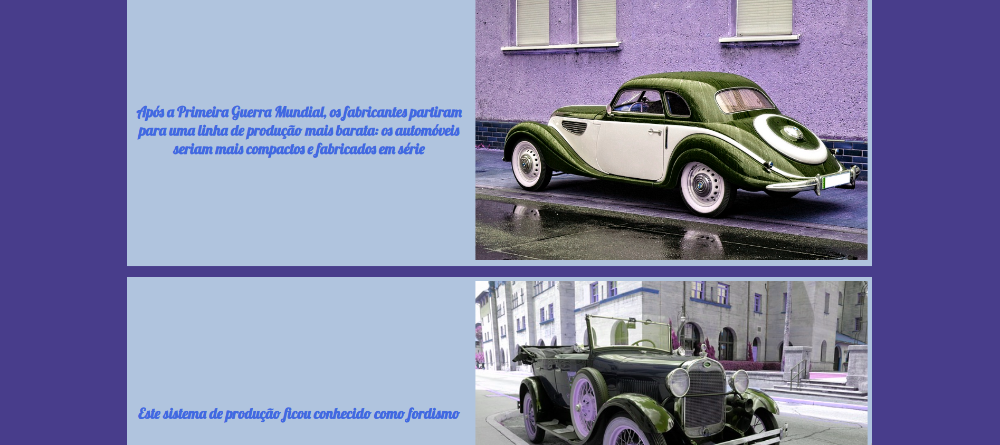

# atividadeCSS-HistoriaAutomovel
uma atividade de CSS feita em aula sobre a história do automóvel para o curso de DS na Etec de Guarulhos.
  

  <h3>Página de CSS simples sobre carros para aprender.</h3>
     

  <h3>Se passar o mouse em cima, a imagem fica com a cor original.</h3>
  

